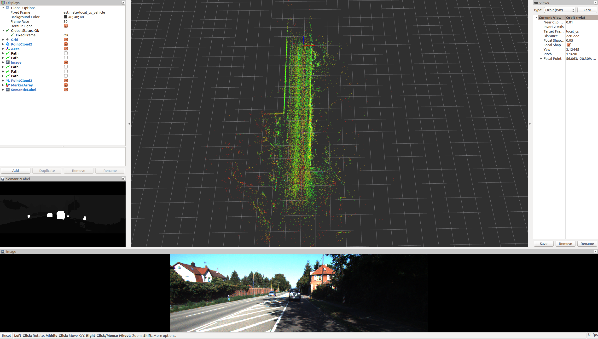

# LIMO

## 1. Introduction

Lidar-Monocular Visual Odometry. This library is designed to be an open platform for visual odometry algortihm development. We focus explicitely on the simple integration of the following key methodologies:

- Keyframe selection
- Landmark selection
- Prior estimation
- Depth integration from different sensors.
- Scale integration by groundplane constraint.


## 2. Cititation

This work was accepted on IROS 2018. See https://arxiv.org/pdf/1807.07524.pdf .

If you refer to this work please cite:

```
@inproceedings{graeter2018limo,
  title={LIMO: Lidar-Monocular Visual Odometry},
  author={Graeter, Johannes and Wilczynski, Alexander and Lauer, Martin},
  booktitle={2018 IEEE/RSJ International Conference on Intelligent Robots and Systems (IROS)},
  pages={7872--7879},
  year={2018},
  organization={IEEE}
}
```

Please note that Limo2 differs from the publication. We enhanced the speed a little and added additional groundplane reconstruction for pure monocular visual odometry and a combination of scale from LIDAR and the groundplane (best performing on KITTI). For information on Limo2, please see my dissertation https://books.google.de/books?hl=en&lr=&id=cZW8DwAAQBAJ&oi .


## 3. Build

```shell
mkdir -p ~/limo_odom_ws/src
cd src
git clone --rescursive https://github.com/kinggreat24/limo_kitti.git
catkin_make -j4
```


## 4. Run

- Using rosbags

  - get test data [Sequence 04](https://drive.google.com/open?id=16txq5V2RJyJH_VTsbeYOJzSWR5AKOtin) or [Sequence 01](https://drive.google.com/open?id=1u7RFNSvx3IY6l3-hIHBEL1X3wUGri8Tg). This is a bag file generated from Kitti sequence 04 with added semantic labels.

  - run

    ```shell
    roslaunch demo_keyframe_bundle_adjustment_meta kitti_standalone_rosbag.launch 
    ```

- Using KITTI raw files

  ```shell
  roslaunch demo_keyframe_bundle_adjustment_meta kitti_standalone_file.launch sequence_num:=0
  ```

  The **kitti_helper.cpp** will read raw data from files and publish it via rostopic.

  

  

## 5. ToDO

- [ ] Publish the corresponding **TF** information

 

